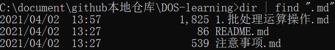
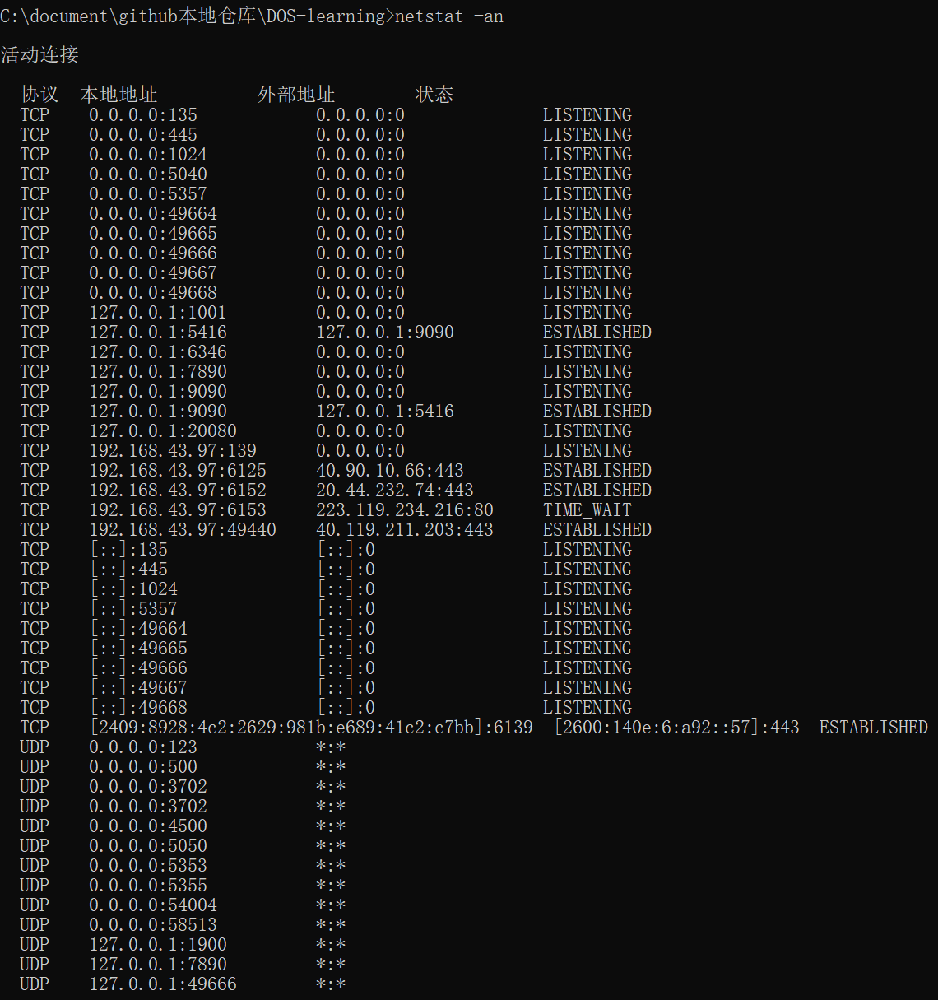
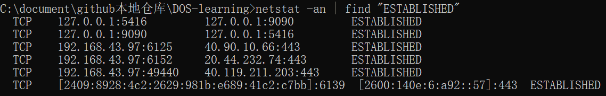

# 批处理运算操作

## 一、算术运算

### 算术符号优先级

`()`> `*`>=`/`>`%`>`+`>=`-`

### 命令模式

`set /a expression`

例如:`set /a 1+2`

### 文本模式

```bash
@echo off  # 关闭回显
set /a var =10*10
echo %var%  # 变量用 % 框起来
pause  # 执行完毕后不关闭页面
```

## 二、重定向运算

### 重定向输出 `>`

写入文件，**覆盖性**写入

#### 实例

```bash
echo "hello world" > a.txt  # 即在当前路径下的 a.txt 文件中写入 hello world
```

	

### 重定向追加输出 `>>`

写入文件，**追加性**写入（会换行）

#### 实例

```bash
echo "hello world" > a.txt 
echo "hello world" >> a.txt
```

	

### `type`

显示文本内容

#### 实例

```bash
echo "hello world" >a.md
type a.md
```

	

### 重定向输入 `<`

要将键盘输入重定向到文件或设备，请使用 < 操作符

例如，要从 File.txt 获取 sort 命令的输入，请键入：`sort < file.txt`

#### 重定向追加输入 `<<`

暂无

## 三、多命令运算

### `&&`

**与**运算符，前后命令都正确时才会运行

#### 实例


前后表达式都为真时才会进行

### `||`

**或**运算

如果第一条命令执行成功，第二条命令就**不执行**了

#### 实例


## 四、管道符号

### `|`

`A|B`：A 命令输出的内容，将会作为 B 命令输入的内容

#### 实例一

 查找文件名中含有 .md 的文件

```bash
dir | find ".md"  
```

	

#### 实例二

```bash
netstat -an
```



查找与外部连接的端口

```bash
netstat -an | find "ESTABLISHED"
```



