# 批处理基本命令

## 1. 命令格式

`命令->子命令->参数->操作->选项`

### 以`net user`为例

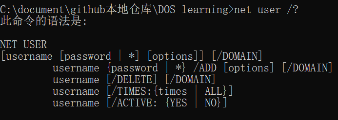

- 输入`命令 /?`来获取该命令的使用说明，输入`命令 /help`来获得完整的帮助信息
- 方括号[] 内为可选内容，写不写都行

#### 实例

```bash
net user test test /add  # 新建一个账号为 test、密码为 test  的账户
```

## 2. 批处理文件参数传递

### `%num`

.bat 文件接受参数使用`%num`

使用方法：文件中用`%1`或者`%2`等表达式表示，命令行中用`filename.bat 参数1 参数2`来赋值传递的参数用空格来分割

#### 实例

```bash
# 文件内容
@echo off
echo %1
echo %2

net user %1 %2 /add  # 新建了一个账户
pause

# 命令行内容
find.bat testAdmin 123456 
```

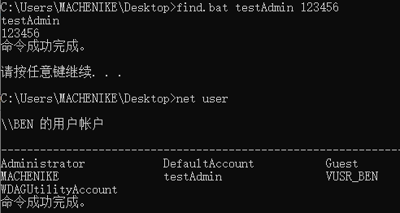	

### 注释符拓展 `rem`

`rem`注释后的文本不会被运行，在`type`查看文本内容的时候也会显示

```bash
@echo off
rem 打印hello world
echo "hello world"
```

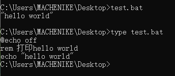	

### 好看的命令提示符

#### 颜色命令 `color`

输入`color \?`可以查看提示

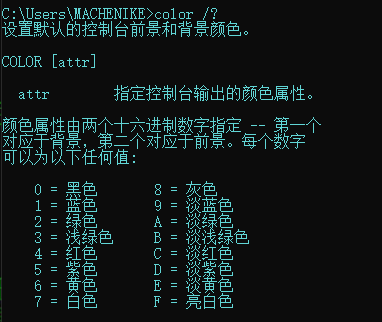	

输入`color 0b`，把命令提示符改为黑色背景和蓝绿色字体

p.s. **关闭**窗口后，再打开还是默认的颜色

#### 标题命令 `title` 

 输入 `title 文本`来改变标题

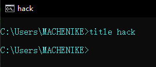	

## 3. 时间相关命令

### `date`：日期

输入`date /t`查看当前日期

### `time `：时间

输入`time /t`查看当前时间

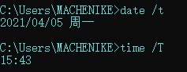	

## 4. 启动相关命令

### `start`

启动一个单独的窗口以运行指定的程序或命令。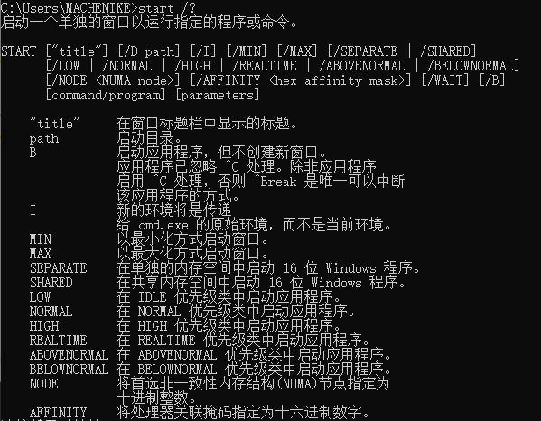

## 5. 调用其他bat文件

### `call`

用法：`call 1.bat`

对调用的文件无法进行参数的传递：`call 2.bat %1`是无效的

```bash
# 运行的文件 1.bat
@echo off 
echo "1.bat"
call 2.bat # 调用文件
pause

# 被调用的文件 2.bat
@echo off
echo "2.bat"
pause
```

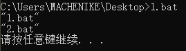	

## 6. 任务列表查看命令

### `tasklist`

查看当前的所有进程

支持本地查看和远程查看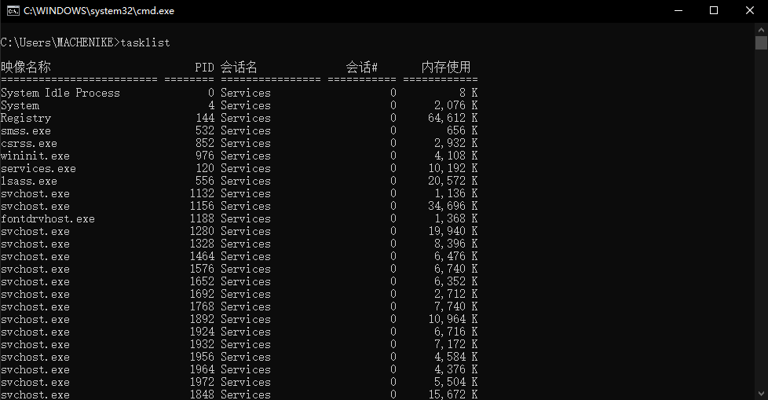

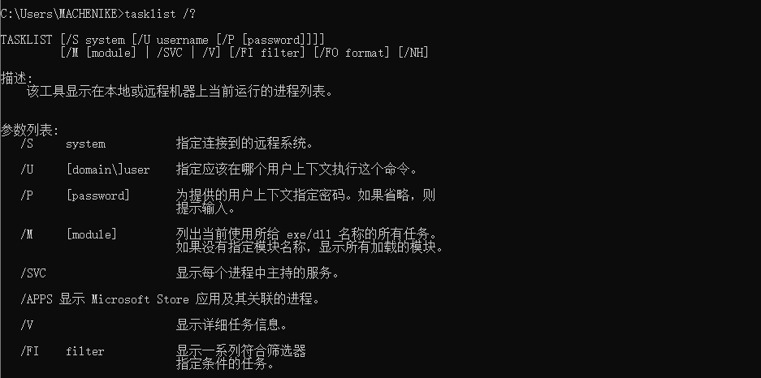

#### FI 筛选器

```bash
tasklist /fi "STATUS eq UNKNOWN"
tasklist /fi "PID eq 144"
```


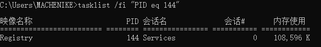	

	

#### FO 指定输出格式

```bash
tasklist /fo csv
tasklist /fo csv > 1.csv
```

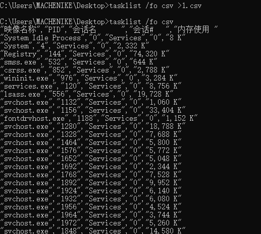	