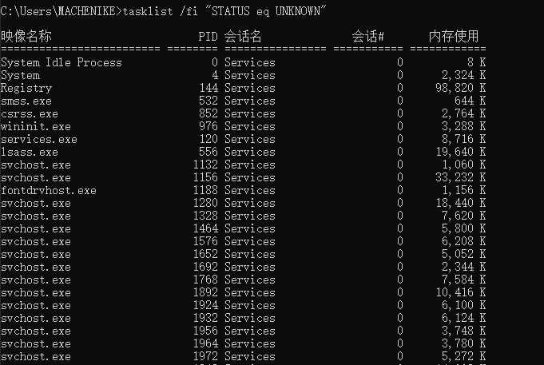

# 批处理基本命令

## 1. 命令格式

`命令->子命令->参数->操作->选项`

### 以`net user`为例


- 输入`命令 /?`来获取该命令的使用说明，输入`命令 /help`来获得完整的帮助信息
- 方括号`[ ]`内为**可选内容**，写不写都行

#### 实例

```bash
net user test test /add  # 新建一个账号为 test、密码为 test  的账户
```

## 2. 批处理文件参数传递

### `%num`

.bat 文件接受参数使用`%num`

使用方法：文件中用`%1`或者`%2`等表达式表示，命令行中用`filename.bat 参数1 参数2`来赋值传递的参数用空格来分割

#### 实例

```bash
# 文件内容
@echo off
echo %1
echo %2

net user %1 %2 /add  # 新建了一个账户
pause

# 命令行内容
find.bat testAdmin 123456 
```

	

### 注释符拓展 `rem`

`rem`注释后的文本不会被运行，在`type`查看文本内容的时候也会显示

```bash
@echo off
rem 打印hello world
echo "hello world"
```

	

### 好看的命令提示符

#### 颜色命令 `color`

输入`color \?`可以查看提示

	

输入`color 0b`，把命令提示符改为黑色背景和蓝绿色字体

p.s. **关闭**窗口后，再打开还是默认的颜色

#### 标题命令 `title` 

 输入 `title 文本`来改变标题

	

## 3. 时间相关命令

### `date`：日期

输入`date /t`查看当前日期

### `time `：时间

输入`time /t`查看当前时间

	

## 4. 启动相关命令

### `start`

启动一个单独的窗口以运行指定的程序或命令。

## 5. 调用其他bat文件

### `call`

用法：`call 1.bat`

对调用的文件无法进行参数的传递：`call 2.bat %1`是无效的

```bash
# 运行的文件 1.bat
@echo off 
echo "1.bat"
call 2.bat # 调用文件
pause

# 被调用的文件 2.bat
@echo off
echo "2.bat"
pause
```

	

## 6. 任务列表查看命令

### `tasklist`

查看当前的所有进程

支持本地查看和远程查看


#### FI 筛选器

```bash
tasklist /fi "STATUS eq UNKNOWN"
tasklist /fi "PID eq 144"
```


	

	

#### FO 指定输出格式

```bash
tasklist /fo csv
tasklist /fo csv > 1.csv  # 输出格式为 csv，写入到 1.csv 文件中
```

	

## 7. 任务关闭命令

### `taskkill`

 

```bash
taskkill /pid 8010
taskkill / fi notepad.exe
```

## 8. 文件夹结构查看命令

### `tree`

 

```bash
tree /F # 查看当前路径的所有文件夹和文件
tree /F D:\steam # 查看给定目录的所有文件夹和文件
```

## 9. 关机命令

### `shutdown`

 

```bash
shutdown /s /t 3600 # 定时关闭计算机，单位为ms
shutdown /a # 停止关闭计算机
shutdown /r # 重启计算机
```

## 10. 计划任务命令

### `schtasks`

1. `schtasks /create `：创建计划任务

   ```bash
   C:\Users\MACHENIKE\Desktop>schtasks /create /?
   
   SCHTASKS /Create [/S system [/U username [/P [password]]]]
       [/RU username [/RP password]] /SC schedule [/MO modifier] [/D day]
       [/M months] [/I idletime] /TN taskname /TR taskrun [/ST starttime]
       [/RI interval] [ {/ET endtime | /DU duration} [/K] [/XML xmlfile] [/V1]]
       [/SD startdate] [/ED enddate] [/IT | /NP] [/Z] [/F] [/HRESULT] [/?]
   
   描述:
        允许管理员在本地或远程系统上创建计划任务。
   
   参数列表:
       /S   system        指定要连接到的远程系统。如果省略这个
                          系统参数，默认是本地系统。
   
       /U   username      指定应在其中执行 SchTasks.exe 的用户上下文。
   
       /P   [password]    指定给定用户上下文的密码。如果省略则
                          提示输入。
   
       /RU  username      指定任务在其下运行的“运行方式”用户
                          帐户(用户上下文)。对于系统帐户，有效
                          值是 ""、"NT AUTHORITY\SYSTEM" 或
                          "SYSTEM"。
                          对于 v2 任务，"NT AUTHORITY\LOCALSERVICE"和
                          "NT AUTHORITY\NETWORKSERVICE"以及常见的 SID
                            对这三个也都可用。
   
       /RP  [password]    指定“运行方式”用户的密码。要提示输
                          入密码，值必须是 "*" 或无。系统帐户会忽略该
                          密码。必须和 /RU 或 /XML 开关一起使用。
   
       /RU/XML    
       
       /SC   schedule     指定计划频率。
                          有效计划任务:  MINUTE、 HOURLY、DAILY、WEEKLY、
                          MONTHLY, ONCE, ONSTART, ONLOGON, ONIDLE, ONEVENT.
   
       /MO   modifier     改进计划类型以允许更好地控制计划重复
                          周期。有效值列于下面“修改者”部分中。
   
       /D    days         指定该周内运行任务的日期。有效值:
                          MON、TUE、WED、THU、FRI、SAT、SUN
                          和对 MONTHLY 计划的 1 - 31
                          (某月中的日期)。通配符“*”指定所有日期。
   
       /M    months       指定一年内的某月。默认是该月的第一天。
                          有效值: JAN、FEB、MAR、APR、MAY、JUN、
                          JUL、 AUG、SEP、OCT、NOV  和 DEC。通配符
                          “*” 指定所有的月。
   
       /I    idletime     指定运行一个已计划的 ONIDLE 任务之前
                          要等待的空闲时间。
                          有效值范围: 1 到 999 分钟。
   
       /TN   taskname     以路径\名称形式指定
                          对此计划任务进行唯一标识的字符串。
   
       /TR   taskrun      指定在这个计划时间运行的程序的路径
                          和文件名。
                          例如: C:\windows\system32\calc.exe
   
       /ST   starttime    指定运行任务的开始时间。
                          时间格式为 HH:mm (24 小时时间)，例如 14:30 表示
                          2:30 PM。如果未指定 /ST，则默认值为
                          当前时间。/SC ONCE 必需有此选项。
   
       /RI   interval     用分钟指定重复间隔。这不适用于
                          计划类型: MINUTE、HOURLY、
                          ONSTART, ONLOGON, ONIDLE, ONEVENT.
                          有效范围: 1 - 599940 分钟。
                          如果已指定 /ET 或 /DU，则其默认值为
                          10 分钟。
   
       /ET   endtime      指定运行任务的结束时间。
                          时间格式为 HH:mm (24 小时时间)，例如，14:50 表示 2:50 PM。
                          这不适用于计划类型: ONSTART、
                          ONLOGON, ONIDLE, ONEVENT.
   
       /DU   duration     指定运行任务的持续时间。
                          时间格式为 HH:mm。这不适用于 /ET 和
                          计划类型: ONSTART, ONLOGON, ONIDLE, ONEVENT.
                          对于 /V1 任务，如果已指定 /RI，则持续时间默认值为
                          1 小时。
   
       /K                 在结束时间或持续时间终止任务。
                          这不适用于计划类型: ONSTART、
                          ONLOGON, ONIDLE, ONEVENT.
                          必须指定 /ET 或 /DU。
   
       /SD   startdate    指定运行任务的第一个日期。
                          格式为 yyyy/mm/dd。默认值为
                          当前日期。这不适用于计划类型: ONCE、
                          ONSTART, ONLOGON, ONIDLE, ONEVENT.
   
       /ED   enddate      指定此任务运行的最后一天的日期。
                          格式是 yyyy/mm/dd。这不适用于计划类型:
                           ONCE、ONSTART、ONLOGON、ONIDLE。
   
       /EC   ChannelName  为 OnEvent 触发器指定事件通道。
   
       /IT                仅有在 /RU 用户当前已登录且
                          作业正在运行时才可以交互式运行任务。
                          此任务只有在用户已登录的情况下才运行。
   
       /NP                不储存任何密码。任务以给定用户的身份
                          非交互的方式运行。只有本地资源可用。
   
       /Z                 标记在最终运行完任务后删除任务。
   
       /XML  xmlfile      从文件的指定任务 XML 中创建任务。
                          可以组合使用 /RU 和 /RP 开关，或者在任务 XML 已包含
                          主体时单独使用 /RP。
   
       /V1                创建 Vista 以前的平台可以看见的任务。
                          不兼容 /XML。
   
       /F                 如果指定的任务已经存在，则强制创建
                          任务并抑制警告。
   
       /RL   level        为作业设置运行级别。有效值为
                          LIMITED 和 HIGHEST。默认值为 LIMITED。
   
       /DELAY delaytime   指定触发触发器后延迟任务运行的
                          等待时间。时间格式为
                          mmmm:ss。此选项仅对计划类型
                          ONSTART, ONLOGON, ONEVENT.
   
       /HRESULT          为获得更出色的故障诊断能力，处理退出代码
                          将采用 HRESULT 格式。
   
       /?                 显示此帮助消息。
   
   修改者: 按计划类型的 /MO 开关的有效值:
       MINUTE:  1 到 1439 分钟。
       HOURLY:  1 - 23 小时。
       DAILY:   1 到 365 天。
       WEEKLY:  1 到 52 周。
       ONCE:    无修改者。
       ONSTART: 无修改者。
       ONLOGON: 无修改者。
       ONIDLE:  无修改者。
       MONTHLY: 1 到 12，或
                FIRST, SECOND, THIRD, FOURTH, LAST, LASTDAY。
   
       ONEVENT:  XPath 事件查询字符串。
   ```
   
   
   
   ```bash
   示例:
       ==> 在远程机器 "ABC" 上创建计划任务 "doc"，
           该机器每小时在 "runasuser" 用户下运行 notepad.exe。
   
           SCHTASKS /Create /S ABC /U user /P password /RU runasuser
                    /RP runaspassword /SC HOURLY /TN doc /TR notepad
   
       ==> 在远程机器 "ABC" 上创建计划任务 "accountant"，
           在指定的开始日期和结束日期之间的开始时间和结束时间内，
           每隔五分钟运行 calc.exe。
   
           SCHTASKS /Create /S ABC /U domain\user /P password /SC MINUTE
                    /MO 5 /TN accountant /TR calc.exe /ST 12:00 /ET 14:00
                    /SD 06/06/2006 /ED 06/06/2006 /RU runasuser /RP userpassword
   
       ==> 创建计划任务 "gametime"，在每月的第一个星期天
           运行“空当接龙”。
   
           SCHTASKS /Create /SC MONTHLY /MO first /D SUN /TN gametime
                    /TR c:\windows\system32\freecell
   
       ==> 在远程机器 "ABC" 创建计划任务 "report"，
           每个星期运行 notepad.exe。
   
           SCHTASKS /Create /S ABC /U user /P password /RU runasuser
                    /RP runaspassword /SC WEEKLY /TN report /TR notepad.exe
   
       ==> 在远程机器 "ABC" 创建计划任务 "logtracker"，
           每隔五分钟从指定的开始时间到无结束时间，
           运行 notepad.exe。将提示输入 /RP
           密码。
   
           SCHTASKS /Create /S ABC /U domain\user /P password /SC MINUTE
                    /MO 5 /TN logtracker
                    /TR c:\windows\system32\notepad.exe /ST 18:30
                    /RU runasuser /RP
   
       ==> 创建计划任务 "gaming"，每天从 12:00 点开始到
           14:00 点自动结束，运行 freecell.exe。
   
           SCHTASKS /Create /SC DAILY /TN gaming /TR c:\freecell /ST 12:00
                    /ET 14:00 /K
       ==> 创建计划任务“EventLog”以开始运行 wevtvwr.msc
           只要在“系统”通道中发布事件 101
   
           SCHTASKS /Create /TN EventLog /TR wevtvwr.msc /SC ONEVENT
                    /EC System /MO *[System/EventID=101]
       ==> 文件路径中可以加入空格，但需要加上两组引号，
           一组引号用于 CMD.EXE，另一组用于 SchTasks.exe。用于 CMD
           的外部引号必须是一对双引号；内部引号可以是一对单引号或
           一对转义双引号:
           SCHTASKS /Create
              /tr "'c:\program files\internet explorer\iexplorer.exe'
              \"c:\log data\today.xml\"" ...
   ```
   
   

## 11. 批处理环境变量

### `set`

`set`查看环境变量

 