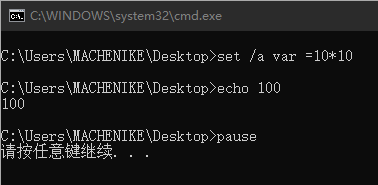

# 注意事项

## `@echo off`

关闭回显，不显示正在执行的批处理命令及执行的结果等（默认是开启的）

### 实例：开启回显

#### 代码

```bash
set /a var =10*10
echo %var%
pause
```

#### 结果

	

### 实例：关闭回显

#### 代码

```bash
@echo off
set /a var =10*10
echo %var%
pause
```

#### 结果

	